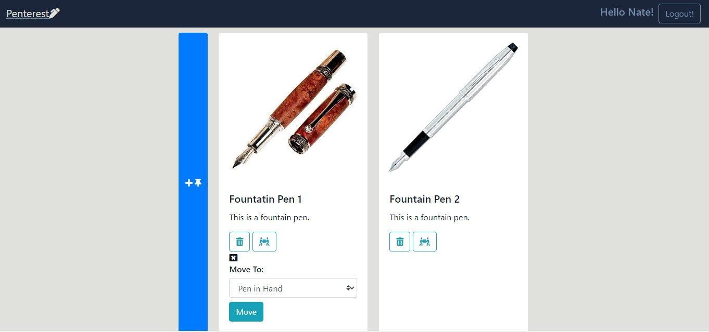

# NSS E12 Exercise - Pinterest Site

## Description:
The sixth exercise at NSS. The objective of the exercise was to create a site similar to Pinterest. This project was our introduction to Firebase, Axios, and CRUD.

## Features:
1. User Auth with Google. 
1. Displays Boards and Pins when User is logged in.
1. User can add their own boards and pins.
1. User can upload image for new pin.
1. User can delete their boards and pins.
1. User can move their pins between their boards. 
1. Project uses HTML, CSS, JS, JQuery, Firebase, Axios
1. Project has responsive design.

## Screenshots:
##### Login View:

##### Board View:

##### Create New Board View:

##### Pins View:

##### Create New Pin View:

## How To Run:
Project is deployed at https://pinterest-a8c45.web.app
